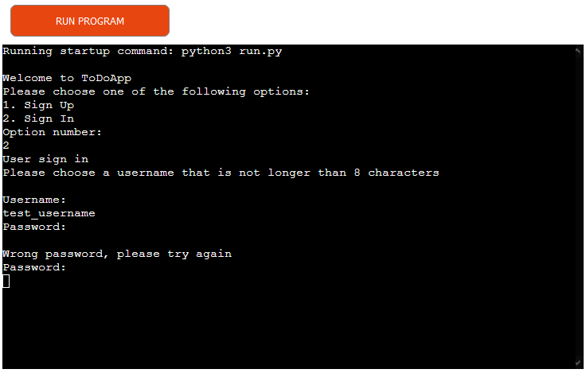

# ToDoApp

## Introduction

Welcome to my ToDoApp. It's meant to be a simple way to quickly write down daily tasks and, once completed, to delete them. 
The only possible actions are add, edit and delete and the data is stored on Google Sheets for peristance.

[Live Website](https://todo-app-kaospctqc.herokuapp.com/)

## Table of Contents

1. [Planning](#planning)
2. [Features](#features)
3. [Technologies](#technologies)
4. [Testing](#testing)
5. [Deployment](#deployment)
6. [Credits](#credits)

## Planning
Diagram:

The concept is to design a todo application that is intuitive and requires as little learning from the user as possible. There is a strong emphasis on simplicity and it is not meant to replace more complex, project tracking tools but to have a quick option to write down a task and then, upon completion, to delete and forget it.
The lack of history is a tool used to keep our focus on getting things done rather than keeping things tracked.

Go back to [Table of contents](#table-of-contents)

## Features

- When starting the todo app we have these options

    - SignUp 
        - for new users
        - requires a username and a password that will be used to identify this user in the future
        - after SignUp is complete, the user will be automatically signed in the application 
    - SignIn 
        - for existing users
        - the user is required to input a username and a password
        - in the event that the password is not correct, the user will not be signed in until he inputs the correct password

- Once Signed in, the user will always have access to the list of tasks

    - The task list is composed of 2 columns
        - ID - this will be used to identify the task when to perform an action
        - Description - here we find the actual content of the task
    - At the end of the task list we find the available actions that are selectable by typing the letter in the square brakets'[]'

- Add will simply ask for the data of a new task

- Delete will ask for the task ID that should be removed

- Edit will ask for the task ID that should be edited and, once this has been provided, will request a new Description for the selected task

Go back to [Table of contents](#table-of-contents)

## Technologies

This project makes use of a few different technologies to enable it's functionality.
- Google Sheets are used as backend storage for 
    - user credentials 
    - task data
- Python external resources:
    - gspread                   - is a Python API for Google Sheets.
    - google.oauth2.credentials - provides credentials based on OAuth 2.0 access and refresh tokens.
    - getpass                   - used to hide passwords during input

All other code, unless explicitly specified, was created by myself.

Go back to [Table of contents](#table-of-contents)

## Testing

### Functionality Testing
TEST            | OUTCOME                          | PASS / FAIL  | ScreenShot
--------------- | -------------------------------- | ---------------|---------
SignUp SignIn   | when a user inputs a incorrect option, they should be requested to input correct information | PASS | 
SignUp used username | when a user wants to use a username that has already been used, they shouldn't be allowed and should be prompted to try another username | PASS | 
SignUp password confirmation | upon signup, a user must be asked to confirm the chose password to avoid mistakes | PASS | 
SignUp success  | when a user inputs valid username and password, they should be able perform signup | PASS | 
SignIn bad password | when a users inputs a incorrect password on signin, they should be asked for the correct password instead of being signed in | PASS | 
SignIn success  | when a user inputs correct username and password, they should be able to perform signin | PASS | 
Action validation | only accept expected input in the action menu | PASS | 
Add task        | when a user chooses option [a] and inputs a task description, a task should be created in the task list| PASS | 
Delete task     | when a user chooses option [d] and inputs a task ID, the task with that ID should be removed from the task list | PASS | 
Edit task       | when a user chooses option [e] and inputs a task ID and a task description, the task list should show the edited task | PASS | 
TaskId validation | when a user wants to delete or edit a task, they should not be allowed to input invalid options | PASS | 

Go back to [Table of contents](#table-of-contents)

### Syntax Testing

For this test we use the PEP8 validator and we find that we are missing the end tripple double quotes for a multi-line string

Here we have fixed this issue:

## Deployment

We have deployed to Heroku while using the CodeInstitute provided python template: [python-essentials-template](https://github.com/Code-Institute-Org/python-essentials-template).
On the 7th of December 2021, there was an announcement on the CodeInstitue gitpod channel about e update that happened on gitpod that caused the template to require update. This github repository was created using the previous version of the template. Because of this, some steps are different than what would be required for a new projetct.

### 1. Preparation:
- Create requirements.txt 
    - In order to deploy our app to Heroku, we need to create a requirements.txt file in our repository to hold all the additional modules/libraries that we require.
    - Identify that the CI Love Sandwiches project has identical requirements as the ToDoApp
    - Copy requirements.txt from the [CI Love Sandwiches project](https://github.com/kaospctqc/love-sandwiches)
### 2. Deploy steps
- Navigate to Heroku 

## Credits

This project uses gspread, google-auth, getpass.
There is also some code from the Code Institute Love Sandwiches Project that has been marked with comments to indicate this.
All other code has been created by me, except that which has been explicitly marked as external.